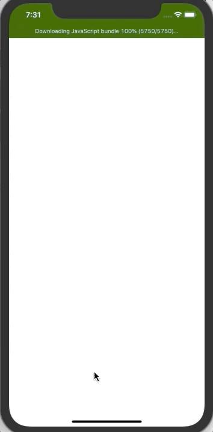

## React-Native Card Memory Game

### About:
This project was developed to study how to implement animations using the Animated API. For that, the following animations were implemented:
- Fade effect in the title using ```Animated.timing()```
- Transform scaleX and scaleY on the play button, creating a loop effect. This implementation was done using ```Animated.sequence()``` with ```Animated.delay()``` and ```Animated.timing()```
- Each card has a flip effect using ```Animated.spring()```
- Finally, when a par of card has matched, an opacity effect is applied, using ```Animated.timing()```.

<p align="center">
  
</p>


### Technologies and libraries used:
- React-Native
- React Navigation 5
- Animated API.

### How to execute:
Warning: this project was developed using the iPhone Simulator, running iOS 13. The code was not tested on Android devices.

After cloning this project and opened the downloaded folder:
- Install all the projects dependencies by using:
```
  yarn
```
- Next, install all the native ios dependencies. For that, execute:
```
  cd ios
  pod install
  cd ..
```
- Finally, start the project using the command:
```
yarn react-native run-ios
```
